# Analysis and Conclusion

The customer requires insights into the performance of the business in key areas, including sales trends, store performance, and the impact of various factors on sales. The business is particularly interested in understanding how weather, holidays, store types, and store sizes affect sales and profitability.

Additionally, the business wants to explore the impact of markdowns on sales during holiday periods.

It is a requirement that all analysis is done based on the last 12 months of data, and that the findings are presented in a clear and concise manner.

Are sales increased if weather is hotter or colder in the last 12 months?
Validation: Test with a suitable plot to show temperature and sales correlation.
Sales differences between holiday and non-holiday weeks per store in the last 12 months
Validation: Compare sales using statistical analysis and visualisation techniques.
What is most profitable store type in the last 12 months?
Validation: Compare store types with weekly sales.

- Does store size affect profitability? If so, how much in the last 12 months?
  Validation: Compare store size with weekly sales
- Weekly Sales by Store, Store Type and Department Last 12 Months
  Validation: Compare weekly sales by store and department using appropriate plot
- Impact of markdowns on sales during holiday periods in the last 12 months by store
  Validation: Accumulate and visualise markdown data per store during holiday periods

## The Journey

The journey to create this data story has been an interesting one. Providing me with lots of challenges and learning opportunities while colating the data and presenting it here for your edification.

## The Analysis

**First Question Asked: Are sales increased if weather is hotter or colder in the last 12 months?**

Let us look at the visualisation that answers that question:

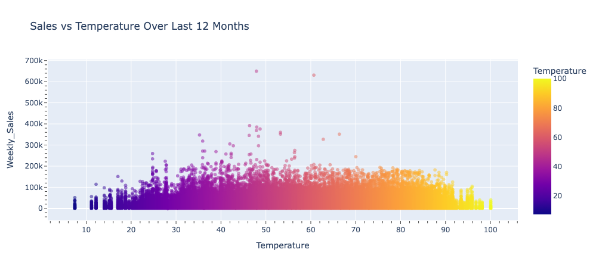

As we can see from the above visualisation, there is a correlation between sales and weather.

There is a clear variance at extreme parts of the temperature range and during the centre range of temperature approximately 42-58 Fahrenheit. So clearly temperature is an effective factor in sales, _but_ other factors could be at play such as the environmental conditions a particular store is in.

Deeper analysis preferably by stores in a sales region would offer a better visualisation of the question.

**Second Question Asked: Sales differences Between Holiday and Non-Holiday Weeks Per Store In The Last 12 Months?**

Let us analyse the visualisation that answers that question:

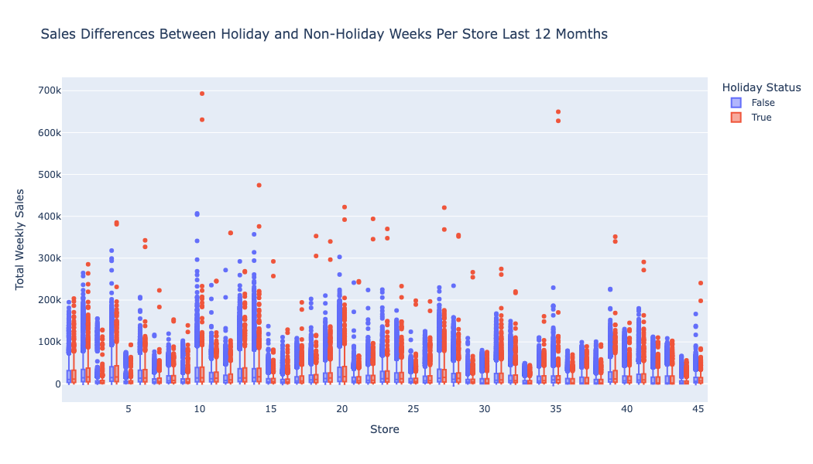

Due to the large amount of data I chose a boxplot style visualisation to show the distribution of sales by store type. Also it allows us to see the outliers in the data and the variance of sales by store, which gives us a quick visual depiction of how holiday weeks affects sales directly.

We can deduce that holiday weeks have a positive effect on sales, and that the variance of sales is greater during holiday weeks than non holiday weeks. Clearly store size also pays a relationship between holiday and non holiday sales volumes, but we can see simply and clearly the effect a holiday week has on footfall and sales.

**Third Question Asked: What Is The Most Profitable Store Type In The Last 12 Months?**

Let us analyse the visualisation that answers that question:

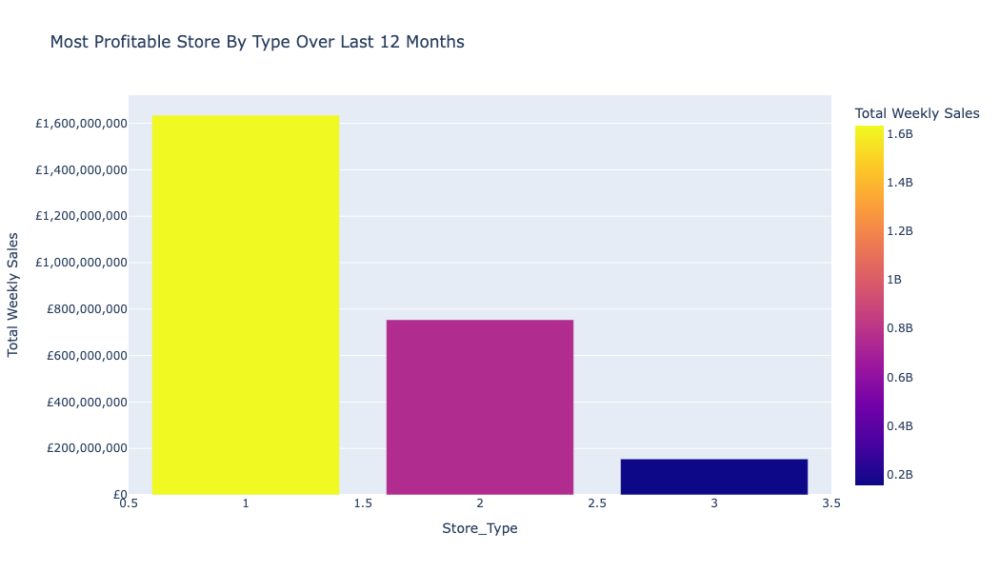

This simple yet direct visualisation show the direct difference between the store _types_ and sales.

It is clear that the type 1 store is the most profitable store type in the last 12 months, and that the type 3 store is the least profitable store type in the last 12 months, but being a different type may by nature have a smaller customer based, but does not imply that it is not a profitable one in comparision to its market and customer base.

**Fourth Question Asked: Does Store Size Affect Profitability? If So, How Much In The Last 12 Months?**

This question requires a lot of visualisation to answer, simply due to the amount of stores to analyse, so let us look at groups of stores by size and their sales in the last 12 months.

These visualisations are split 5 visualisations for groups of stores i.e. 1-9 etc so bear with me!

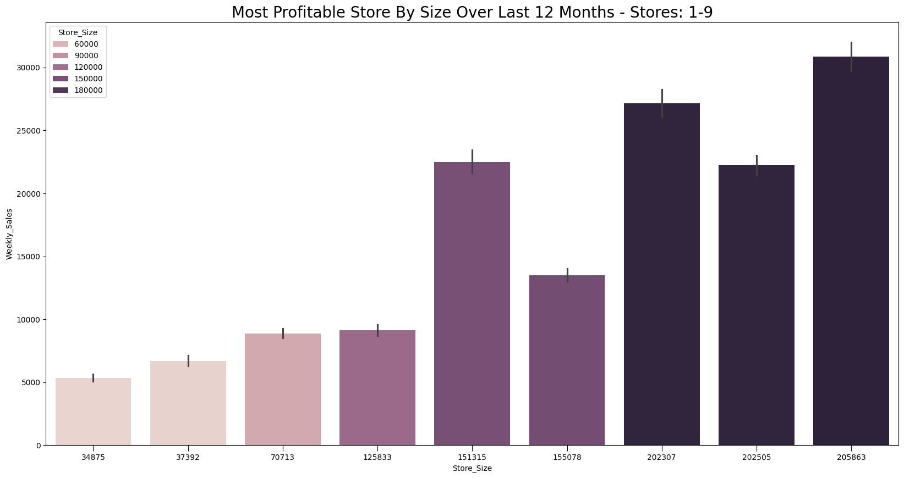

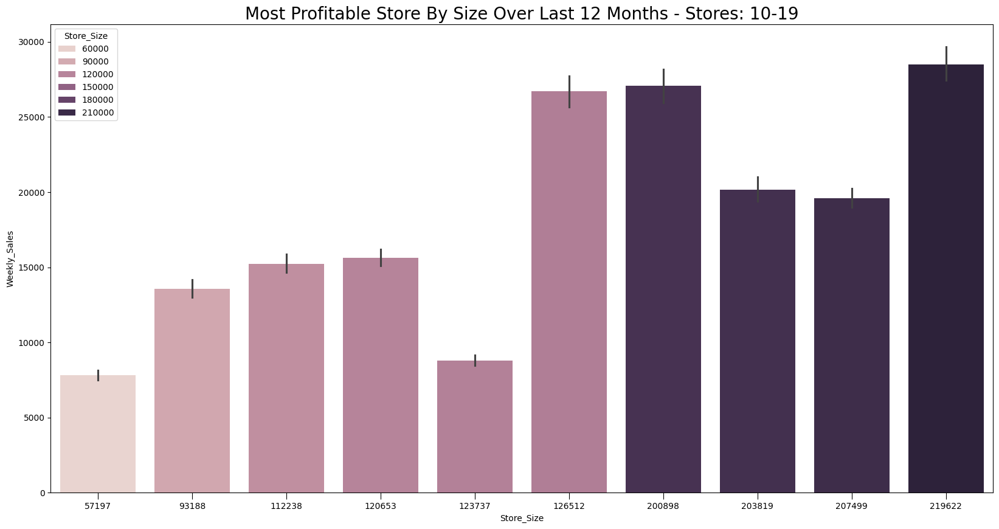

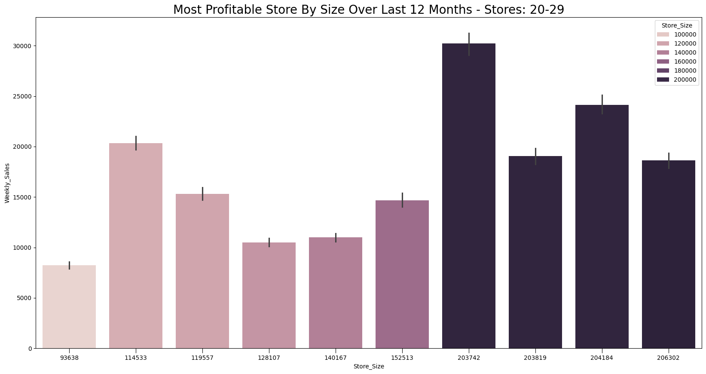

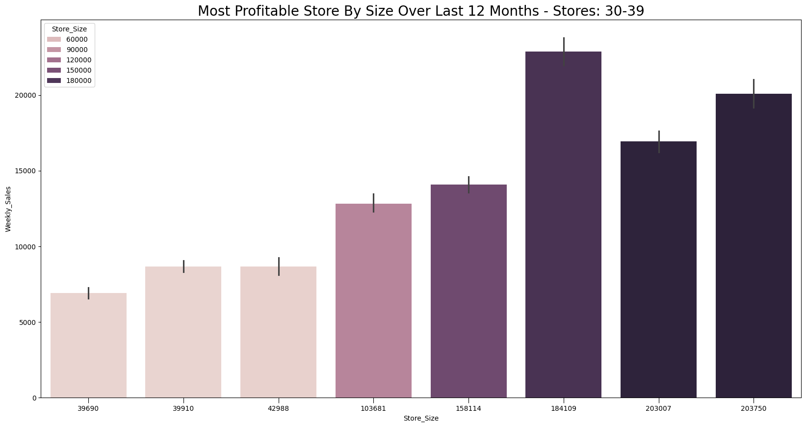

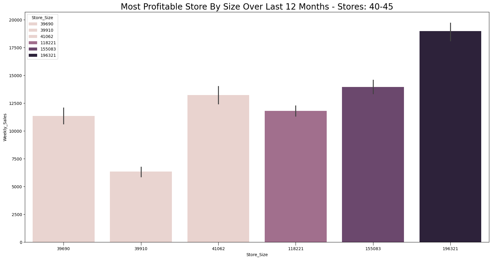

An interesting visualisation that shows the correlation between store size and sales. It is clear that there is a positive correlation between store size and sales, but it is not a linear correlation, as we can see from the plot, and remember a smaller stores is not necessarily a less profitable store, as it may have a smaller customer base, but is still profitable in its own right _but_ suggest additional analysis regarding store _type_ in correlation to size and sales would be a logical next step.

In stores: 9, 19, 26, 37 all have high sales but store 26 is the highest. Further analysis of theses stores by _type_ could yield some fascinating insights.

**Question Five Asked: Weekly Sales By Store, Store Type And Department Last 12 Months?**

Let us analyse the visualisation that answers that question:

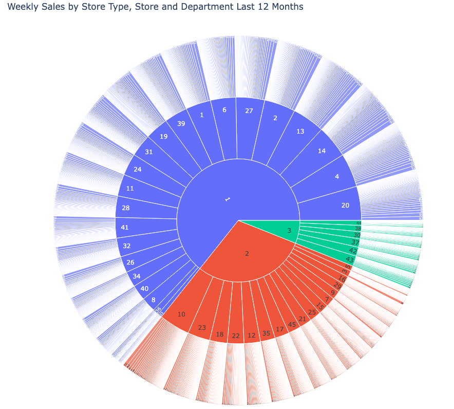

As you are aware this is more than a visualisation it is an interactive tools, whereby you can "drill down" into the details and experience the data in a more dynamic way.

As we can see the visualisation is presented as a circular dial with the outer ring representing the weekly sales, next ring inwards is the store number then finally the centre ring is the store type.

Hovering the mouse over any section exposes brief details:

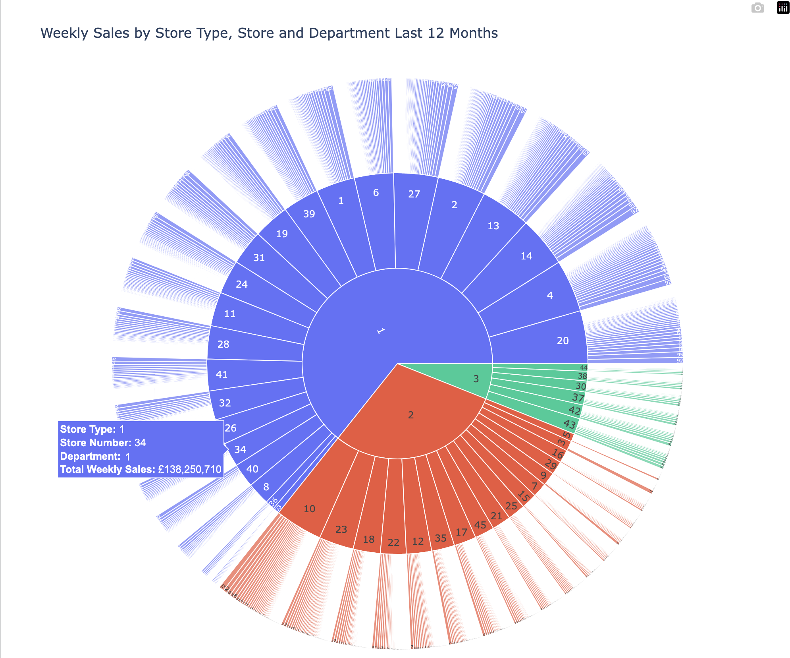

Here we can see the mouse hovering over the outer ring shows store type, the store number, department and weekly sales yet we can go deeper:

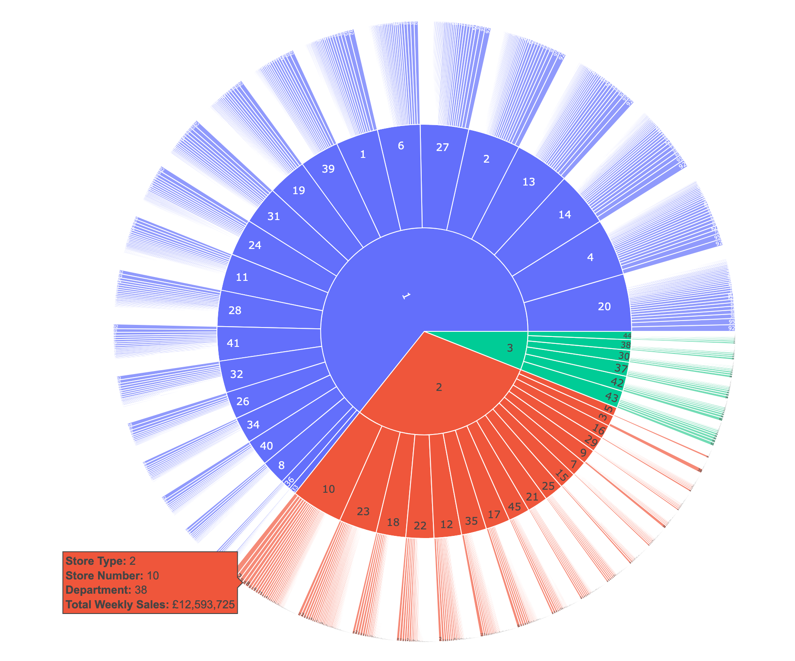

Here can see the mouse hovering over the first inner ring and can see the same information as the outer ring, but we can go deeper still double clicking on a store number drills into the data that creates the data box we have seen in the previous two images:

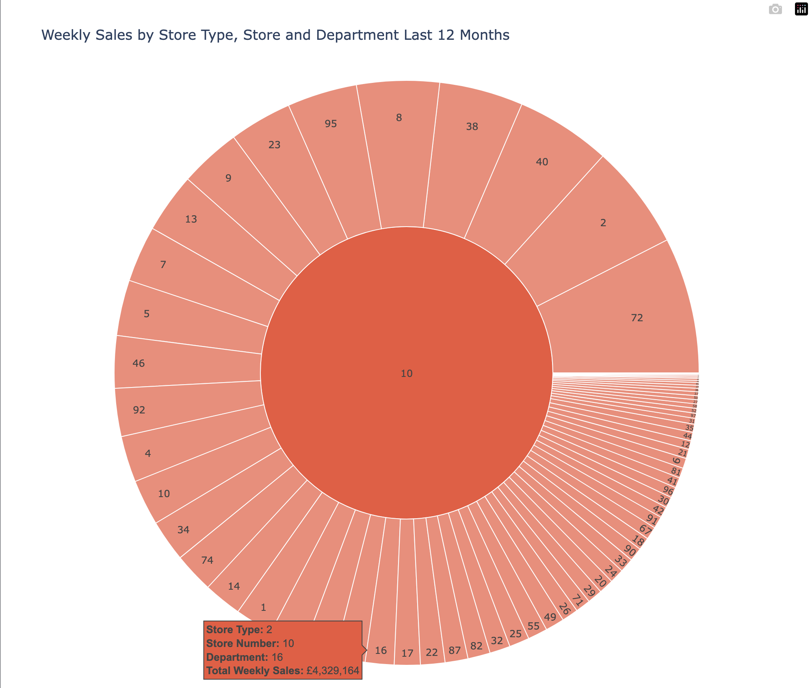

No we can see each departments sales performance within that store, and as we can see when we hover the mouse over a department the information for that exact department.

Also take note in the previous image the centre ring clearly shows that store type 1 has the most profitable stores, and that store type 3 has the least profitable stores, but as we have seen previously this does not mean that they are not profitable in their own right.

**Question Six Asked: Impact Of Markdowns On Sales During Holiday Periods In The Last 12 Months By Store?**

This is a nice detailed yet not too complex visualisation that just as you have discovered is the same methodology as the previous visualisation in that it is interactive, so we can "drill down" into finer detail.

As we cane see when we hover the mouse over a markdown section we can see the store number, the markdown amount and the sales for that store during the holiday period.

When we double click on a store number we can see detailed markdown information for the store:

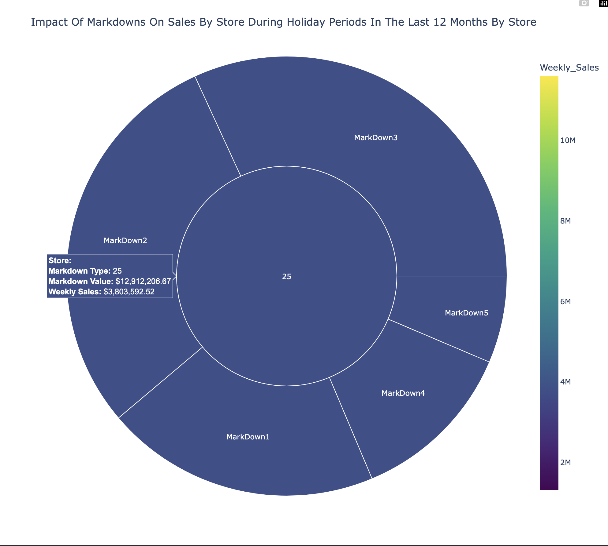

Interactive insights are great when dealing (as we are) with a lot of data e,g. number of stores and their departments, and act as a great presentation tool for internal Q&A session regarding store performance and profitability.

## Conclusion

The brief was to perform analysis based on a 12 month dataset looking at many contributing factors that can affect business profitability such as temperature, holiday periods, store type, store size and the effect of markdowns on sales during holiday periods.

This small glimpse into these factors yields interesting insights and starts conversations as to how and why and identifies operational factors that could be effecting or enhancing performance.

Holiday periods consistently yielded higher weekly sales, confirming the importance of marketing focus during these periods to maximise sales and profitability, taking into account regional characteristics and local trading conditions also likely to influence customer behaviour.

The effect store characteristics have has a significant effect on performance. The type 1 stores consistently accrued higher sweekly sales, whilst type 3 achieved the lowest. However as stated before just because a store type is not meeting the weekly sales highs of a type 1 does not make it a loss-leader. As differences in market sector, customer base and even environmental factors can all affect sales performance beyond physical store size and it is important to consider these factors when evaluating store performance.

The interactive visualisations provide a powerful tool for exploring the data story and excruding insights from data provided. Allowing managers to identify trends, investigate individual stores, analysis as to the true effectiveness of certain store types, as well measure the actual effectiveness markdowns have on profit during holiday periods. These tools provide evidence based insights by taking complex data and presenting it in a clear concise manner.

While several meaningful insights have been attained it does not establish causality. Variables such as environment, competition, local economic conditions, and customer demographics were outside the scope of this project, and could also impact (if not actually) sales performance.

Future analysis incorporating these factors would provide a more comprehensive understanding of the drivers of profitability and valuable insights into their cause and effect.

Overall the analysis provides clear evidence that holiday periods, store type, size and even temperature all contribute to variations in weekly sales performance.

These insights can be used for inventory planning, marketing strategies, and identify opportunites to improve the performance of individual stores and perhaps even regional expansion.

By continuing to build upon these findings with more detailed regional and operational analysis, the business can make better informed strategic decisions and further enhance profitability with the goal of expanding market share, profit margins and overall business growth.
